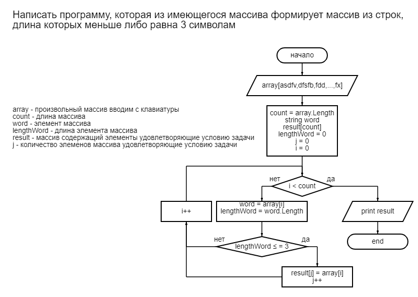

# Итоговая проверочная работа

1. Создаем репозиторий на GitHub
2. Рисуем блок схему

## Блок схема решения задачи

## Сфоримровали репозитарий

[Ссылка на GitHub](https://github.com/Andrey211263/I-Quarter.git "Итоговое задание")
